# USMLE Prep Pro Tools

### Personal study analytics for high-volume USMLE Q-bank preparation

*Browser-integrated study analytics · session visualization · time-of-day patterns · AI-assisted development*

> **Portfolio case study. Source code, detailed implementation logic, and private development workflows are intentionally not published.**

I built **USMLE Prep Pro Tools** during my own USMLE preparation because I wanted a clearer picture of what my study days actually looked like.

The project began with a simple question counter. Through sustained daily use and repeated refinement, it expanded into a connected toolkit for tracking **question progress, solving versus review activity, focused study blocks, breaks, session history, and time-of-day patterns**.

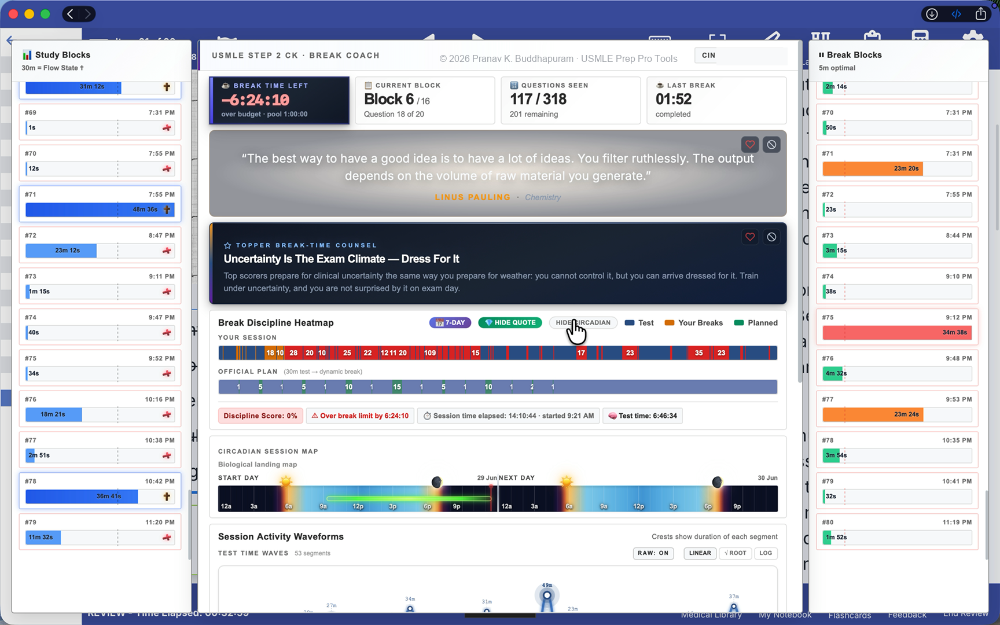
 
<b>Live study-session view combining question progress, focus blocks, breaks, history, coaching, and time-of-day context</b>

> Screenshots reflect my own real study use rather than demonstration data. Some retain earlier internal interface labels from the project's development.

---

## At a Glance

| Component | Purpose |
|---|---|
| **QBank Pro Assist** | Live session interface for question progress, focus and break behavior, timelines, history, coaching, and time-of-day context |
| **Test Timer** | Tracks questions actively solved and converts question volume into daily, hourly, and long-term analytics |
| **Review Timer** | Separately tracks completed-question review so solving and reviewing remain distinct study activities |

The separation between **solving new questions** and **reviewing completed questions** became one of the most important design decisions in the project. They are different study activities, so I wanted each to have its own history and analytics.

---

# QBank Pro Assist

## From Session Planning to Live Tracking

Before a study session begins, the interface establishes the session structure and provides the context needed to start intentionally rather than simply opening the Q-bank and beginning.

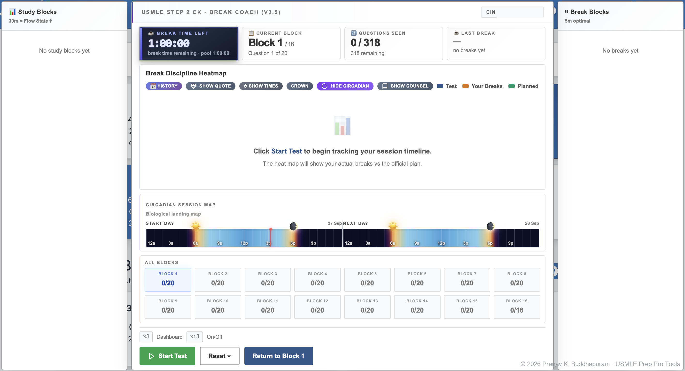
 
<b>Ready state before the session begins</b>

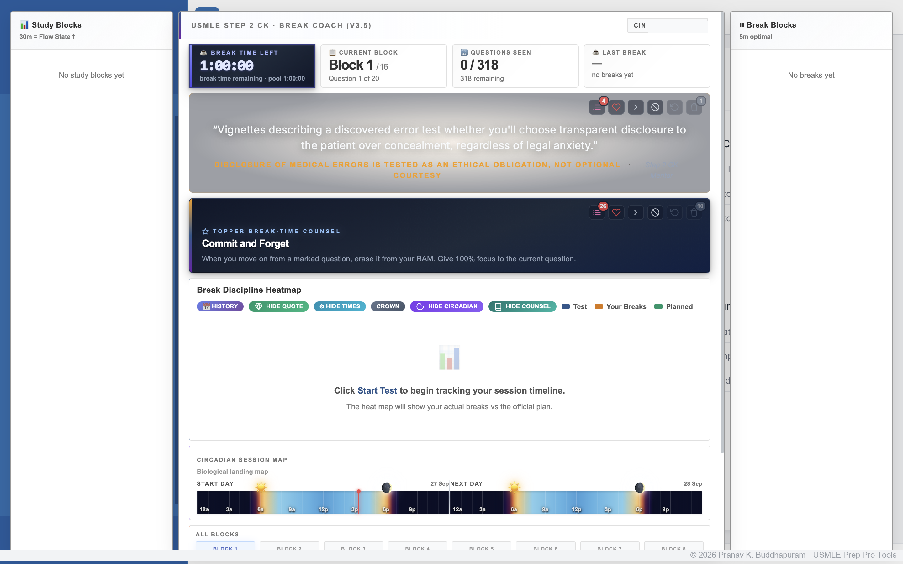
 
<b>Pre-session coaching and prior-performance context</b>

Once active, the same interface becomes a live representation of the study session: questions completed, focused study periods, breaks, elapsed time, and session behavior update as the day develops.

---

## Seeing the Shape of a Study Session

Raw totals were not enough for me.

Two study days could contain similar total hours but feel completely different depending on how fragmented those hours were.

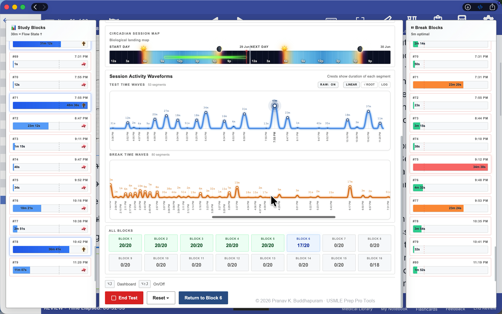
 
<b>Study and break activity represented as separate session waveforms</b>

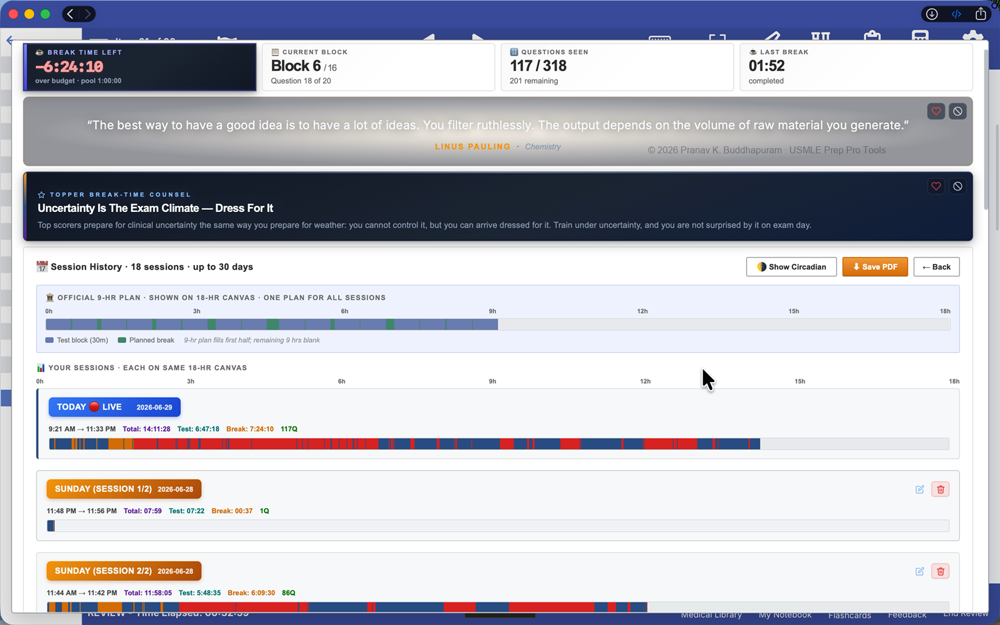
 
<b>Historical sessions aligned to the same 18-hour canvas for comparison</b>

Long uninterrupted blocks, short interruptions, extended breaks, start times, session duration, and question volume become easier to compare visually instead of disappearing inside a single total-duration number.

---

## Time-of-Day Context

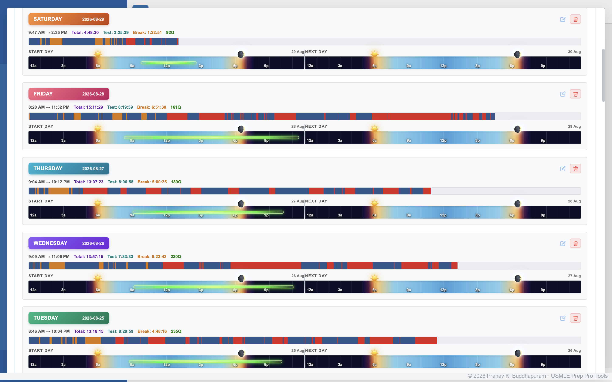
 
<b>Multi-day history showing when study sessions occurred across the day</b>

Adding time-of-day context helped me see when sessions tended to begin, where longer focused periods appeared, and how those patterns shifted across different days.

---

# Solving vs. Review

I deliberately avoided combining all question activity into one counter.

**Questions solved** and **questions reviewed** are tracked separately so each can develop its own history.

<table>
<tr>
<td width="50%" valign="top" align="center">
<b>Questions Solved</b>  
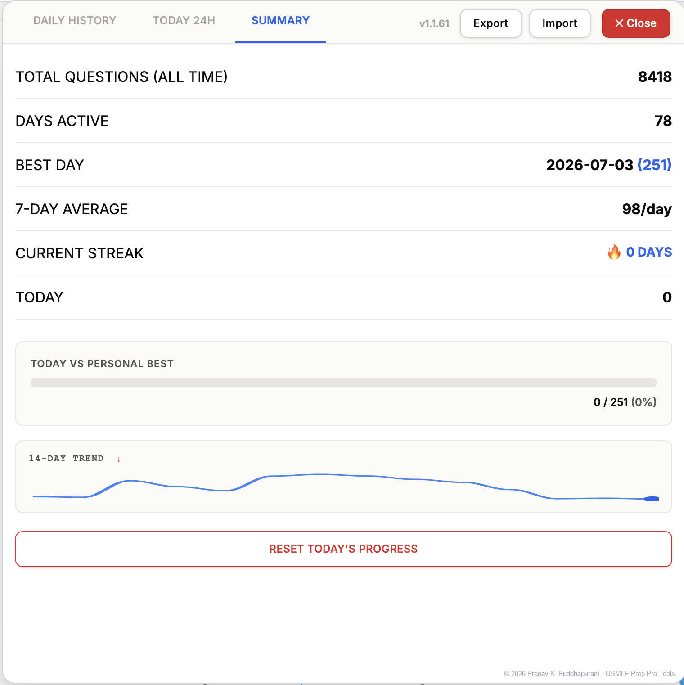
</td>
<td width="50%" valign="top" align="center">
<b>Questions Reviewed</b>  
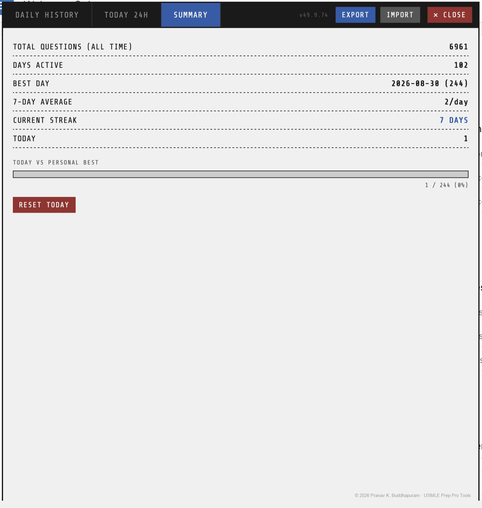
</td>
</tr>
</table>

These views reflect sustained real-world use rather than a small demonstration dataset.

---

## Daily Progress

The daily question graph was where the entire project began.

Once question volume became visible day by day, productive and unproductive periods were much easier to recognize.

<table>
<tr>
<td width="50%" valign="top" align="center">
<b>Daily solving history</b>  
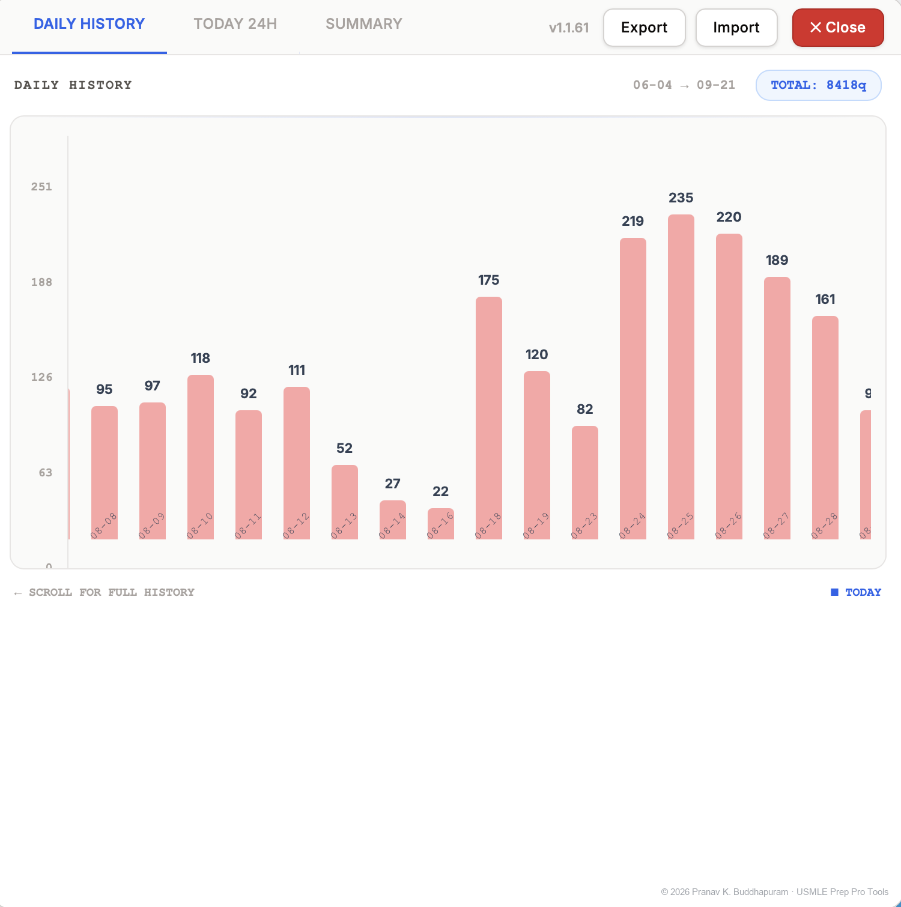
</td>
<td width="50%" valign="top" align="center">
<b>Daily review history — August</b>  
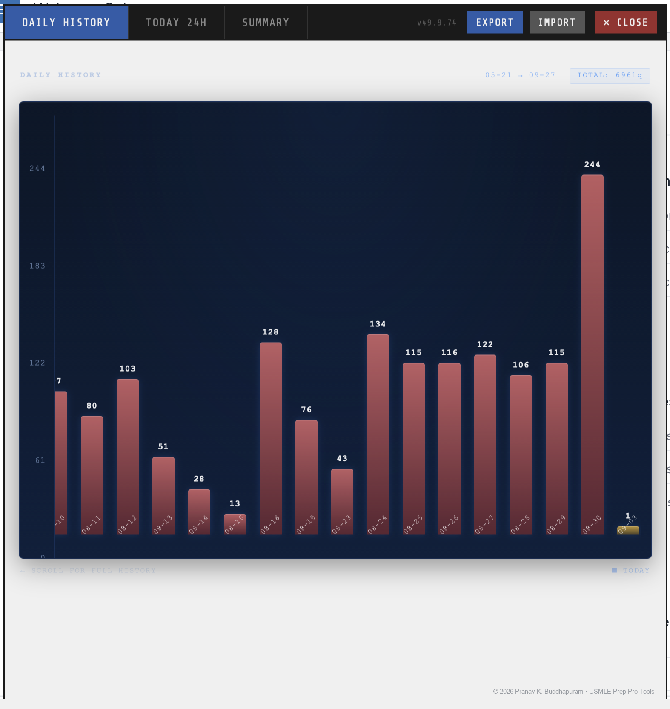
</td>
</tr>
</table>

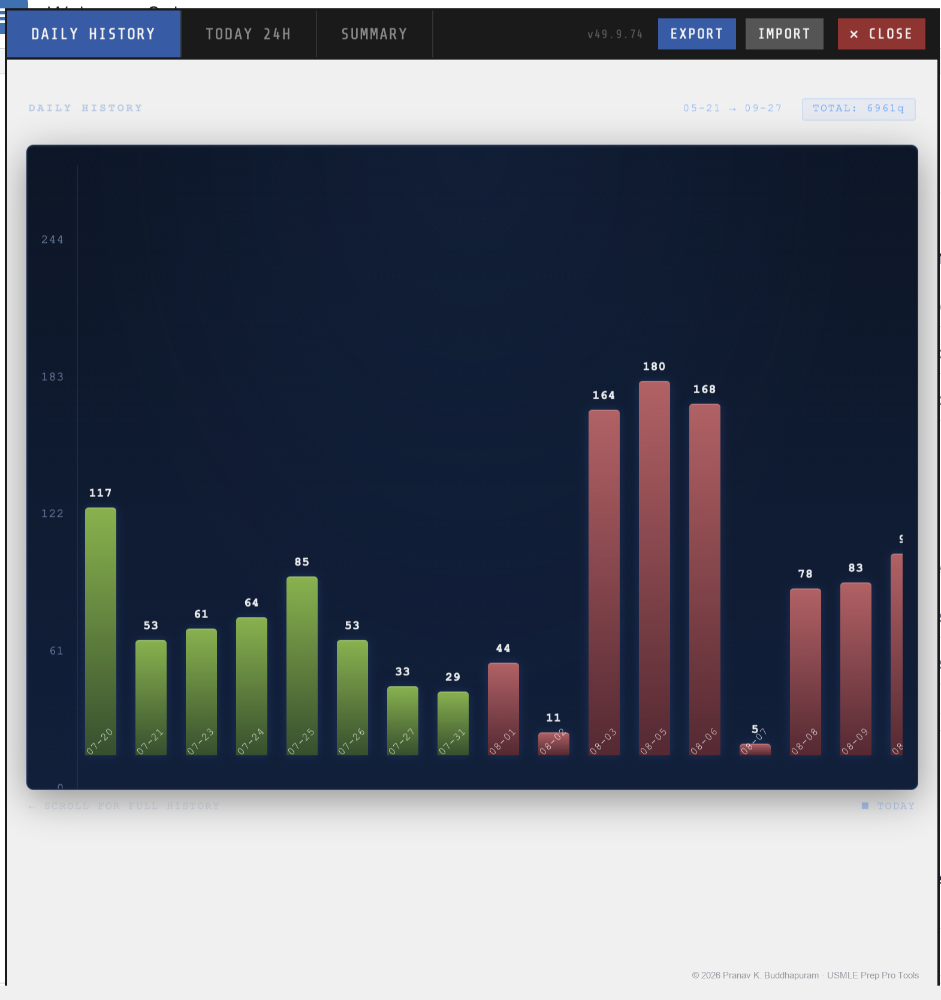
 
<b>Earlier review history — useful for comparing different phases of preparation</b>

---

## Time-of-Day Activity

Daily totals answer **how much** I studied.

Hourly views helped answer **when** the productive bursts were occurring.

<table>
<tr>
<td width="50%" valign="top" align="center">
<b>Question-solving activity by hour</b>  
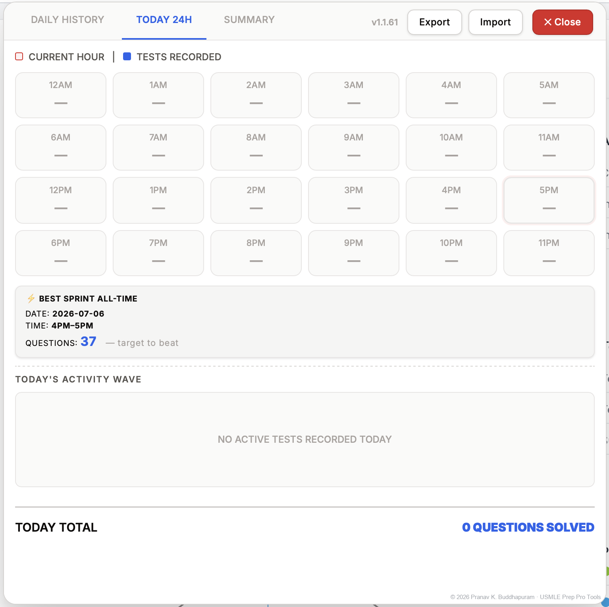
</td>
<td width="50%" valign="top" align="center">
<b>Question-review activity by hour</b>  
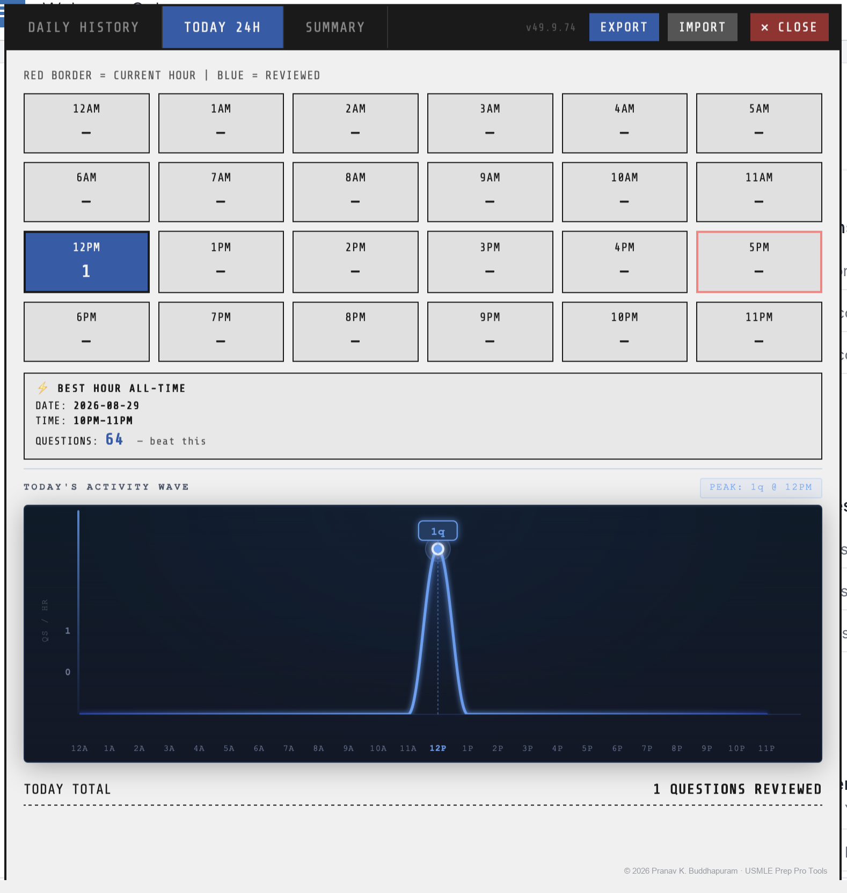
</td>
</tr>
</table>

---

# Why I Built It

The original problem was simple: without a visual record, my progress felt vague.

A day could feel productive without producing much question volume, while another day could contain substantial work but feel less satisfying.

Making the work visible changed that.

As I used the first counter, new problems emerged: missed or duplicate counts, different question workflows, solving versus reviewing, interruptions, session transitions, and the need to compare one study day with another.

Each real-world limitation led to another round of refinement.

What began as **one daily graph** gradually became a broader personal study-analytics system.

---

## AI-Assisted Development

I did not hand-code the entire toolkit from scratch.

I defined the problems, desired behavior, workflows, constraints, and edge cases; used AI coding tools to generate and revise implementations; and then repeatedly tested the software during real study sessions.

My role centered on:

**problem definition → specification → AI-assisted implementation → testing → failure detection → debugging direction → validation → refinement**

The flagship QBank Pro Assist tool went through **70+ iterations** because everyday use continually exposed behaviors that were difficult to anticipate in advance.

What I am showcasing is therefore not line-by-line manual programming, but the combination of **problem solving, system design, AI-assisted development, sustained testing, debugging, and iterative refinement** required to turn an idea into a tool I could actually rely on.

---

<strong>Technical Notes & Evolution</strong>

 

### Technical foundation

The tools are browser-based JavaScript applications running as local overlays on existing web interfaces.

At a high level, the system uses:

- local browser storage for persistence,
- browser-based graphics for timelines and visualizations,
- shared local data between connected components,
- and a client-side architecture without an external database.

Detailed storage structures, synchronization logic, algorithms, selectors, and implementation details remain private.

### How the project evolved

The progression was roughly:

1. **Question progress** — reliable counting and daily visualization
2. **Solving vs. review** — separate workflows and analytics
3. **Focus and breaks** — session structure beyond question totals
4. **Session history** — comparison across days
5. **Time-of-day context** — recurring timing patterns

Each stage arose from a limitation exposed through real daily use rather than from a fixed product specification.

---

## Personalization

Because this was built for my own study environment rather than as a generic commercial product, I included a personal motivational layer with coaching prompts, selected quotations, and optional elements reflecting my Christian faith.

I have kept that visible because it was part of the authentic system I used rather than something added later for presentation.

---

## Project Status

**Personal-use toolkit / portfolio case study**

The working source code and detailed implementation remain private.

The repository is intended to demonstrate the project's purpose, interface, development process, and real-world use without publishing the implementation required to reproduce it.

This is an independent personal project and is **not affiliated with, sponsored by, or endorsed by any examination organization or Q-bank provider.**

---

## Author

**Pranav Krishna Buddhapuram**

Orthopaedic surgeon with interests in medical education, research, productivity systems, data-informed self-improvement, and practical AI-assisted software development.

---

## Intellectual Property

© 2026 Pranav Krishna Buddhapuram. All rights reserved.

This repository is a portfolio showcase only. No license is granted for copying, reproducing, redistributing, modifying, reverse-engineering, or commercially using the project, its implementation, or its proprietary design elements.
